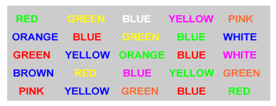

# Testing a Perceptual Phenomenon

This is my work for the first project of the Udacity Data Analyst Nanodegree.

You can access the report:
* in the [Jupyter Notebook](Data_Analyst_ND_Project1.ipynb);
